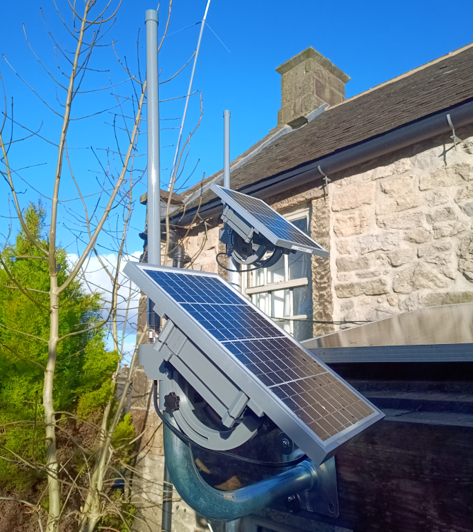
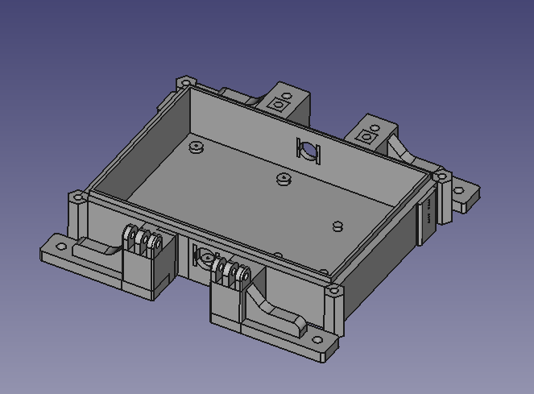
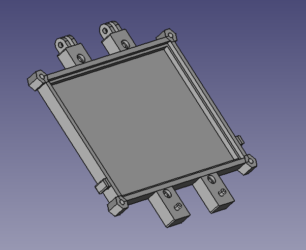
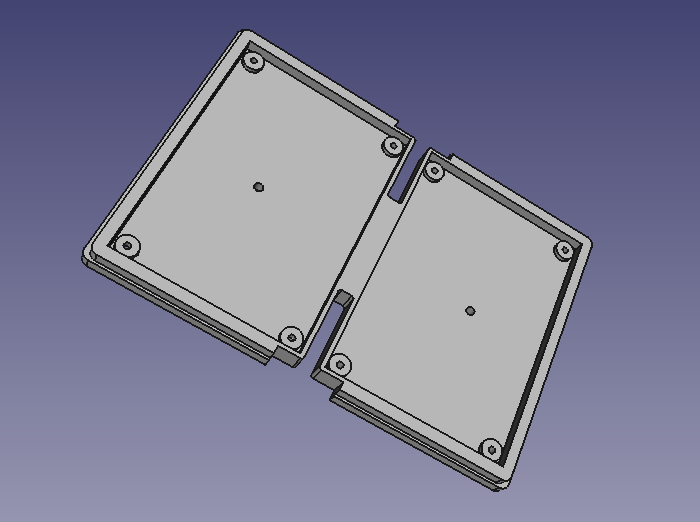
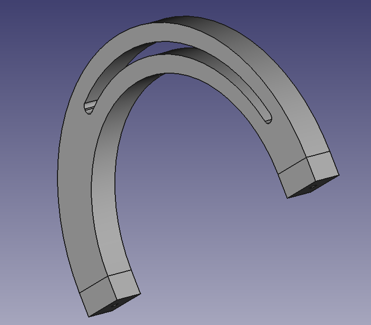
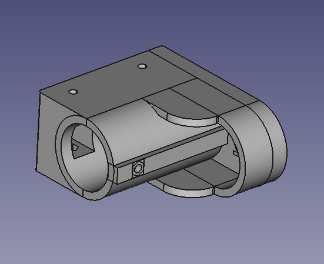
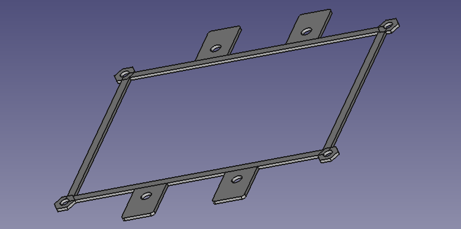

This repositroy contains all the design file required to build a 10W Solar APRS digirepeater

It is based around the Heltec LoRa WiFi V4 board which is readily available from Amazon or Aliexpress:

	https://heltec.org/project/wifi-lora-32-v3/

For LoRa APRS buy the "EU433" version not the EU868 version

In the "Freecad" directory you will find six 3D design files.They are as follows:

1. ECOM10W_Solar_Panel_Case8.FCStd1 (ECOM10W_Solar_Panel_Case8-BodyRemove\ Annomaly.amf)

This file is the main body of the case as shown below

2. ECOM10W_Solar_Panel_Front9.FCStd (ECOM10W_Solar_Panel_Front9-BodyArch\ Arm\ Recess\ Slightly\ Bigger.amf)

This is the front panel or lid of the case as shown below:

3. ECOM10W_Solar_Panel_Case_Insert.FCStd (ECOM10W_Solar_Panel_Case_Insert-BodyFillet003.amf)

This is the tray that the MPPT PCB and 18650 battery PCB sit in

4. ECOM10W_Solar_Panel_Arch_Arm5.FCStd (ECOM10W_Solar_Panel_Arch_Arm5-BodyScrew\ Holes.amf )

This is the arched arm of the design; two are required.

5. ECOM10W_Solar_Pole_Mount6.FCStd (ECOM10W_Solar_Pole_Mount6-BodyFillet001.amf)

This is the pole mounting assembly.

6. ECOM10W_Solar_Panel_Gaskett.FCStd (ECOM10W_Solar_Panel_Gaskett-BodyPocket002.amf)

This is the gaskett which sits between the main body and front panel (lid) of the design

Additional Hardware.

In addition to the above PCB and 3D printed files, to complete this design you will need the following parts

1. N-Type to IPEX (U.FL) pigtail

2. SP13 Male and Female Connector

3. LM2596S Buck DC-DC board.

4. JST 1.25mm (2P) SMA

5. EU433 or EU868 Antenna

6. Heltec LoRa V3 WiFi board. EU433 for APRS, EU868 for Meshtastic

The above are all available from Aliexpress of Amazon:

1. https://www.aliexpress.com/item/1005007261632487.html
2. https://www.aliexpress.com/item/1005006769201518.html
3. https://www.aliexpress.com/item/1005006516043406.html
4. https://www.aliexpress.com/item/1005005721470475.html
5  https://www.aliexpress.com/item/1005006253283206.html
6. https://www.aliexpress.com/item/32886711232.html

Finally it is important to remember that LM2596S Buck DC-DC board has a pot top right. You need to make sure you twiddle that until the ouput (right hand side) is 5v. This is because the above PCB supplies the Heltec board with a 5v supply on pin 1

Any questions, get in touch

Dave {https://www.qrz.com/db/M0JKS)
