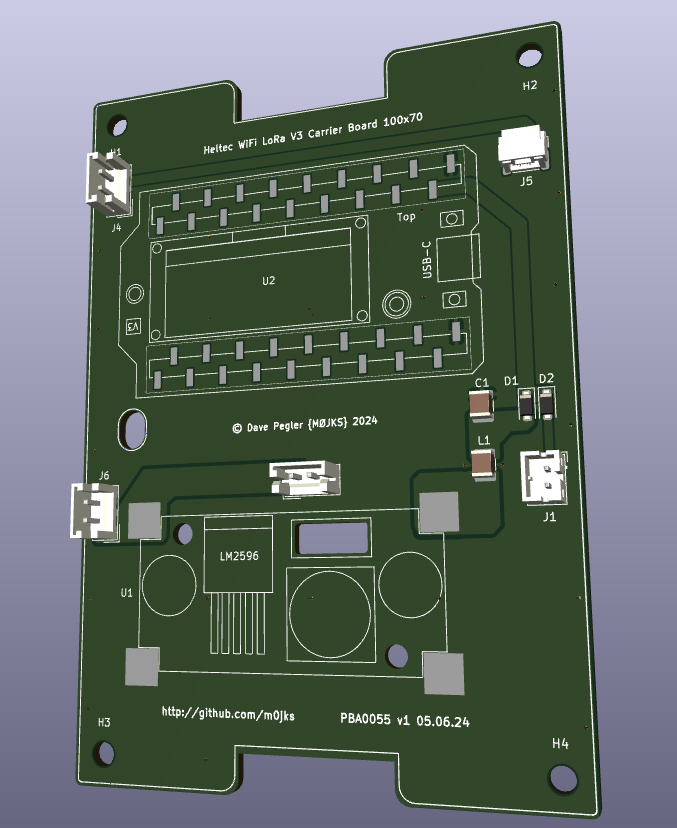
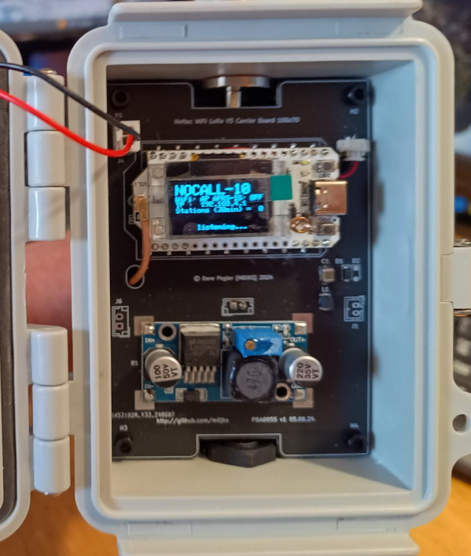
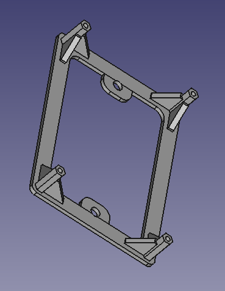
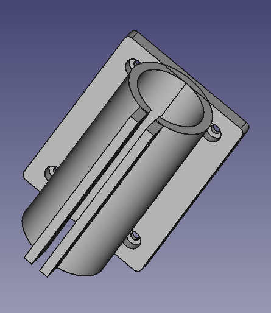
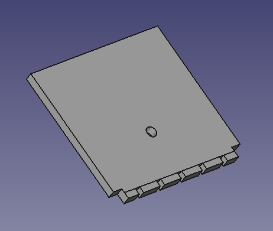

This project is a Simple carrier board for a Heltec Lora WiFi V3 board.

This board can be purchased from Amazon or Aliexpress:

	https://www.aliexpress.com/item/1005007594267069.html

For LoRa APRS buy the EU433 version, for Meshtastic buy the EU868 version

The Kicad PCB in the "Kicad" directory is designed to fit in the following (120x90x70) IP67 case:

	https://www.aliexpress.com/item/1005005387771681.html

In the "Freecad" directory you will find three 3D design files.They are as follows:

1. LoRa_APRS_node_mounting_plates_100x70_studs.FCStd

This is a mounting place for the Kicad PCB inside the body of the IP67 case. It raises the PCB so that the N-Type to IPEX fitting sits neatly underneath it (and the PCB ground plane).

2. IP67_Case_38mm_mast_clamp.FCStd

This is an external mounting fixture fo the (120x90x70) case - to a 1.5" (38mm) mast. It requires two M4 nuts and bolts to clamp the two halves together.

3. IP67_Case_Antenna_Hole_Template.FCStd

This is a hole drilling template for the top N-Type and bottom SP13 power connector.

Additional Hardware.

In addition to the above PCB and 3D printed files, to complete this design you will need the following parts

1. N-Type to IPEX (U.FL) pigtail

2. SP13 Make and Female Connector

3. LM2596S Buck DC-DC board.

4. JST 1.25mm (2P) SMA

5. EU433 or EU868 Antenna

6. Heltec LoRa V3 WiFi board. EU433 for APRS, EU868 for Meshtastic

The above are all available from Aliexpress of Amazon:

1. https://www.aliexpress.com/item/1005007261632487.html
2. https://www.aliexpress.com/item/1005006769201518.html
3. https://www.aliexpress.com/item/1005006516043406.html
4. https://www.aliexpress.com/item/1005005721470475.html
5  https://www.aliexpress.com/item/1005006253283206.html
6. https://www.aliexpress.com/item/32886711232.html

Finally it is important to remember that LM2596S Buck DC-DC board has a pot top right. You need to make sure you twiddle that until the ouput (right hand side) is 5v. This is because the above PCB supplies the Heltec board with a 5v supply on pin 1

Any questions, get in touch

Dave {https://www.qrz.com/db/M0JKS)
